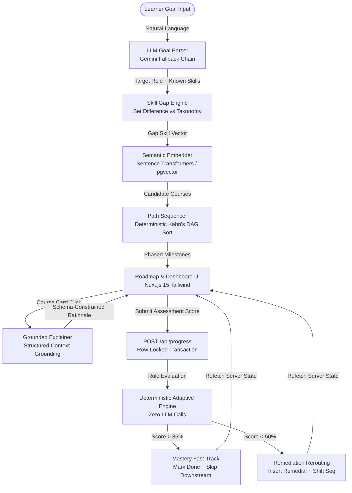

# CourseTide 🌊
### Grounded, Adaptive AI Learning Path Recommender

[](https://nextjs.org/)
[](https://fastapi.tiangolo.com/)
[](https://neon.tech/)
[](https://pytest.org/)
[](https://course-tide.vercel.app/)

---

## 1. Executive Overview

**CourseTide** is an AI-powered personalized learning path intelligence platform that bridges the gap between natural language career aspirations and rigorous, prerequisite-respecting curriculum execution. 

Unlike traditional open-loop course recommenders that return static, disjointed lists of links, CourseTide extracts structured competency profiles from conversational learner goals, detects granular skill gaps, sequences courses into topologically sorted prerequisite milestones, generates grounded, schema-constrained explanations using verified learner/course context, and dynamically adapts the curriculum in real time based on assessment outcomes.

- **Live Production URL:** [https://course-tide.vercel.app/](https://course-tide.vercel.app/)
- **Live Health Endpoint:** [https://course-tide.vercel.app/health](https://course-tide.vercel.app/health)
- **Deployment Status:** Production-deployed MVP ready for controlled validation
- **Target Track (MVP):** Machine Learning & Data Engineering (`domain IN ('ml', 'general')`)

---

## 2. The Problem: Why Static Recommendations Fail

1. **One-Size-Fits-All Inefficiency:** Generic catalogs recommend the same introductory courses regardless of whether the learner already has years of Python or linear algebra experience.
2. **Missing Prerequisite Gating:** Learners are frequently guided into advanced neural network courses before mastering foundational calculus, data manipulation, or linear algebra.
3. **Unbounded AI Hallucinations:** Unconstrained generative chat recommenders invent nonexistent courses, make unsubstantiated claims, or hallucinate curricula without structured grounding.
4. **Open-Loop Disconnect:** When learners struggle with an intermediate module or already possess mastery of a topic, standard platforms cannot adapt the remaining roadmap.

---

## 3. Core Product Capabilities

- **Natural Language Intake:** Extracts target roles, recognized known skills, and time constraints from free text using a resilient Gemini model fallback chain (`gemini-3.7-flash` $\to$ `gemini-3.6-flash` $\to$ `gemini-3.5-flash`).
- **Granular Skill-Gap Analysis:** Computes set differences against canonical target role taxonomies, separating proven competencies from active gaps.
- **Hybrid Semantic & Gap Matching:** Ranks candidate courses via sentence-transformer embeddings ($384$-d dense vectors) combined with gap-coverage ratios and primary-skill anchors.
- **Deterministic Topological Milestone Sequencer:** Kahn's topological sort over canonical skill-level DAGs groups courses into strict chronological phases (Foundations $\to$ Core Competencies $\to$ Specialized Methods).
- **Grounded "Why This?" Explainer:** LLM-generated rationale constrained strictly to structured gap inputs and prerequisite dependencies using verified learner/course context.
- **Closed-Loop Adaptive Engine:** Fast deterministic rule engine that mutates the active roadmap in real time with **no external LLM calls** ($>85.0\%$ triggers mastery fast-tracking; $<50.0\%$ triggers remedial insertion).
- **Lightweight Assessment Submission:** Simple, demo-friendly assessment score ($0\text{--}100\%$) and difficulty feedback interface directly on actionable course cards (not a full question-bank or quiz-generation engine).
- **Competency Dashboard & Dynamic Horizon Slider:** Live competency radar, phase progress metrics, append-only progress audit history, and an interactive weekly-hours slider that recalculates projected study duration without altering roadmap ordering or persisted learner state.

---

## 4. System Architecture & Engineering Split

CourseTide enforces a strict architectural boundary between **probabilistic AI intake/explanations** and **deterministic curriculum execution**:



### AI vs. Deterministic Responsibility Matrix

| Subsystem | Underlying Technology | Deterministic? | External LLM? |
| :--- | :--- | :---: | :---: |
| **Goal Intake Parsing** | Gemini API (`gemini-3.7-flash` fallback chain) | Probabilistic | Yes |
| **Skill-Gap Detection** | Canonical Role Taxonomy Difference | **Deterministic** | No |
| **Semantic Matching** | Sentence Transformers (`all-MiniLM-L6-v2`) / Cosine Similarity | **Deterministic** | No |
| **Milestone Sequencing** | Kahn's Topological Sort over Skill DAG | **Deterministic** | No |
| **"Why This?" Explainer** | Structured Few-Shot Prompt Grounding | Grounded | Yes |
| **Adaptive Loop (Fast-Track/Remediation)** | Rule Mutation Engine (`>85%` / `<50%`) | **Deterministic** | **No (0 calls)** |
| **Dashboard Metrics** | Relational Aggregations over PostgreSQL / Neon | **Deterministic** | No |

---

## 5. Day 1–5 Functional Evolution

- **Day 1 — Foundation & Schema:** Next.js frontend scaffolding, FastAPI skeleton, PostgreSQL Neon database models, Alembic migrations, and 48-course catalog seeding.
- **Day 2 — Recommender Core:** LLM goal parser with multi-model fallback chain, skill gap set difference engine, dense vector embeddings, and hybrid candidate ranking.
- **Day 3 — Topological DAG & Grounded Explainer:** Canonical prerequisite DAG sequencing (`path_sequencer.py`), phased timeline UI, and schema-constrained grounded "Why this?" explainer.
- **Day 4 — Adaptive Loop & Progress Dashboard:** Progress event persistence (`POST /api/progress`), deterministic mastery fast-tracking, remediation rerouting with sequence shifting, and learner competency dashboard.
- **Day 5 — Deployment, Progress UI & Packaging:** Production deployment verification on Vercel/Neon, lightweight assessment submission modal, live browser verification, comprehensive documentation, and submission packaging.

---

## 6. Deterministic Adaptive Learning Rules

When a learner completes an assessment on an active course, the backend executes deterministic adaptation without LLM calls:

```text
Progress Event (assessment_score, difficulty_feedback)
   │
   ├── score > 85.0% ──► MASTERY FAST-TRACK
   │                      • Course status set to 'done'
   │                      • Primary skill marked 'known' with mastery_score = max(score, existing)
   │                      • Downstream redundant courses sharing same primary skill marked 'skipped'
   │                      • If phase completed, downstream phase transitions from 'locked' to 'available'
   │
   ├── score < 50.0% ──► REMEDIATION INSERTION
   │                      • Course remains active for reinforcement
   │                      • Identifies eligible remedial resource of strictly lower difficulty
   │                      • Inserts remedial course at sequence_order + 1
   │                      • Shifts all subsequent roadmap items by +1
   │
   ├── 50.0% <= score <= 85.0% ──► STANDARD COMPLETION
   │                      • Course status set to 'done'
   │                      • Progress recorded without skip or insertion mutations
   │
   └── feedback_only (no score) ──► QUALITATIVE LOG
                          • Progress event persisted in append-only audit history
```

### Metrics: Genuine Completion vs. Effective Progress

To prevent fast-tracked skips from inflating actual course completions, CourseTide separates metrics:

$$\text{Genuine Completion Percentage} = \frac{\text{completed\_courses}}{\text{total\_courses}} \times 100$$

$$\text{Effective Progress Percentage} = \frac{\text{completed\_courses} + \text{skipped\_courses}}{\text{total\_courses}} \times 100$$

- **`done`:** Genuine completion (the learner actively completed and passed the course).
- **`skipped`:** Adaptive fast-track bypass (the learner proved mastery, allowing redundant introductory material to be safely bypassed).

---

## 7. API Surface Contract

All backend routes are exposed by FastAPI under the `/api` prefix and served with same-origin routing in production:

| Method | Endpoint | Purpose | State Mutation? | External LLM? |
| :--- | :--- | :--- | :---: | :---: |
| `POST` | `/api/profile` | Parses free-text goal, creates/updates learner profile, returns recommended candidates. | **Yes** | Yes (Gemini) |
| `GET` | `/api/skill-gap/{learner_id}` | Computes required vs. known vs. gap skills for learner's target role. | No | No |
| `GET` | `/api/roadmap/{learner_id}` | Returns topologically sorted, phased learning path respecting prerequisites. | No | No |
| `GET` | `/api/explain/{learner_id}/{course_id}` | Generates grounded explanation of why a course is recommended and phased. | No | Yes (Gemini) |
| `POST` | `/api/progress` | Records score/feedback, runs deterministic adaptive loop, mutates roadmap. | **Yes** | No |
| `GET` | `/api/dashboard/{learner_id}` | Returns progress metrics, competency radar, phase pacing, and next action. | No | No |
| `GET` | `/health` | Health check probe returning service status and version. | No | No |

---

## 8. Database Schema Overview

```text
┌────────────────────────────────────────────────────────┐
│                   LEARNER-OWNED TABLES                 │
├───────────────────┬────────────────────────────────────┤
│ learners          │ ID, goal, parsed_goal JSONB, pace  │
│ learner_skills    │ Learner competencies, mastery score│
│ learning_paths    │ Phased roadmap, course status, seq │
│ progress_events   │ Append-only progress audit history │
└───────────────────┴────────────────────────────────────┘
┌────────────────────────────────────────────────────────┐
│                   CATALOG DATA TABLES                  │
├───────────────────┬────────────────────────────────────┤
│ skills            │ Taxonomy skills (22 rows)          │
│ courses           │ Course catalog & vector embeddings │
│ course_skills     │ Many-to-many skill bridges         │
│ assessments       │ Skill assessment threshold configs │
└───────────────────┴────────────────────────────────────┘
```

---

## 9. Local Development & Setup

### Prerequisites
- **Node.js:** v18.17+ or v20+
- **Python:** v3.11, v3.12, or v3.13
- **Database:** Local SQLite (default for development/tests) or Neon PostgreSQL

### 1. Repository Clone & Environment Configuration
```bash
git clone https://github.com/WaifuPuller/CourseTide.git
cd CourseTide

# Copy environment template
cp .env.example .env
```

### 2. Backend Setup (FastAPI)
```bash
# Create and activate virtual environment
python -m venv venv
# On Windows:
.\venv\Scripts\activate
# On Linux/macOS:
source venv/bin/activate

# Install dependencies
pip install -r requirements.txt

# Run migrations and seed data
alembic upgrade head
python backend/scripts/seed_db.py

# Start FastAPI development server
uvicorn backend.app.main:app --reload --port 8000
```

### 3. Frontend Setup (Next.js 15)
```bash
# In a separate terminal
cd frontend
npm install

# Start Next.js development server
npm run dev
```

Visit `http://localhost:3000` in your browser.

---

## 10. Environment Variables Reference

| Variable Name | Required? | Description | Example / Default |
| :--- | :---: | :--- | :--- |
| `DATABASE_URL` | Optional | Async connection string for SQLAlchemy | `postgresql+asyncpg://...` (or sqlite) |
| `SYNC_DATABASE_URL` | Optional | Sync connection string for Alembic migrations | `postgresql://...` (or sqlite) |
| `GEMINI_API_KEY` | **Required for LLM** | Google AI Studio API Key | `AIzaSy...` |
| `OPENAI_API_KEY` | Optional | Fallback LLM API Key | `sk-...` |
| `LLM_PROVIDER` | Optional | Primary LLM provider | `gemini` (default) |
| `LLM_MODEL_NAME` | Optional | Primary model override | `gemini-3.7-flash` (default) |
| `EMBEDDING_MODEL_NAME`| Optional | Sentence transformer model | `sentence-transformers/all-MiniLM-L6-v2` |
| `CORS_ORIGINS` | Optional | Allowed CORS origins | `http://localhost:3000` |
| `NEXT_PUBLIC_API_URL`| Optional | Frontend API target | `http://localhost:8000` |

---

## 11. Testing & Verification

CourseTide maintains an automated test suite verifying all API contracts, embedding math, topological sorting, adaptive mutations, and database isolation.

```bash
# Run full backend test suite
python -m pytest backend/tests -v
```

**Verification Status (Point-in-Time Results):**
- **Backend Test Suite:** `138 passed, 0 failed across the executed backend test suite`
- **Frontend Static Build:** `npm run build` static compilation passing with zero type/lint errors
- **Controlled Browser Integration:** Real end-to-end browser execution verified against the deployed application stack

---

## 12. Production Deployment

- **Hosting Architecture:** Unified monorepo deployment on **Vercel** (`@vercel/next` for Next.js 15 frontend and `@vercel/python` serverless wrapper for FastAPI).
- **Database:** Serverless PostgreSQL hosted on **Neon** with pgvector-based embeddings and `NullPool` serverless connection pooling.
- **Production URL:** [https://course-tide.vercel.app/](https://course-tide.vercel.app/)

---

## 13. Known Scope Boundaries & Limitations

- **Lightweight Assessment Interface:** CourseTide provides an interactive assessment submission and difficulty feedback UI to trigger the adaptive engine; it does not build a full generative multiple-choice question bank.
- **Domain Scope (MVP):** Curated specifically for the Machine Learning & Data track (`domain IN ('ml', 'general')`).
- **PostgreSQL Row-Lock Testing:** Async concurrency serialization is implemented using `with_for_update()`; empirical live-race benchmark testing remains a future validation milestone.

---

## 14. Repository Structure

```text
CourseTide/
├── api/                        # Vercel serverless entry point
│   ├── index.py                # FastAPI ASGI handler
│   └── requirements.txt        # Serverless Python dependencies
├── backend/
│   ├── alembic/                # Database migration scripts
│   ├── app/
│   │   ├── api/                # FastAPI routers (profile, roadmap, progress, dashboard, explain)
│   │   ├── models/             # SQLAlchemy declarative models
│   │   ├── recommender/        # AI & deterministic engines (goal_parser, skill_gap, embeddings, path_sequencer, adaptive, explainer)
│   │   ├── config.py           # Pydantic Settings & environment loader
│   │   ├── database.py         # Async SQLAlchemy engine & NullPool setup
│   │   └── main.py             # FastAPI application definition
│   ├── scripts/                # Database seeding utilities
│   └── tests/                  # Pytest test suite (138 tests)
├── data/                       # Seed taxonomy, courses, and prerequisite DAGs
│   ├── courses.csv             # 48 curated courses
│   ├── skills.json             # 22 canonical skills
│   ├── prerequisites.json      # Authoritative skill-level DAG
│   └── target_roles.json       # Target role competency maps
├── docs/                       # Walkthroughs, architecture specs, and execution plans
├── frontend/                   # Next.js 15 application
│   ├── src/app/                # Single-page application & dashboard UI
│   ├── src/lib/api.ts          # Typed API client
│   └── package.json            # Frontend dependencies
├── .env.example                # Environment variable documentation template
├── pyproject.toml              # Pytest configuration
├── requirements.txt            # Root backend dependencies
└── vercel.json                 # Vercel deployment & rewrite configuration
```

---

## 15. License

This project is licensed under the MIT License. See [LICENSE](LICENSE) for details.